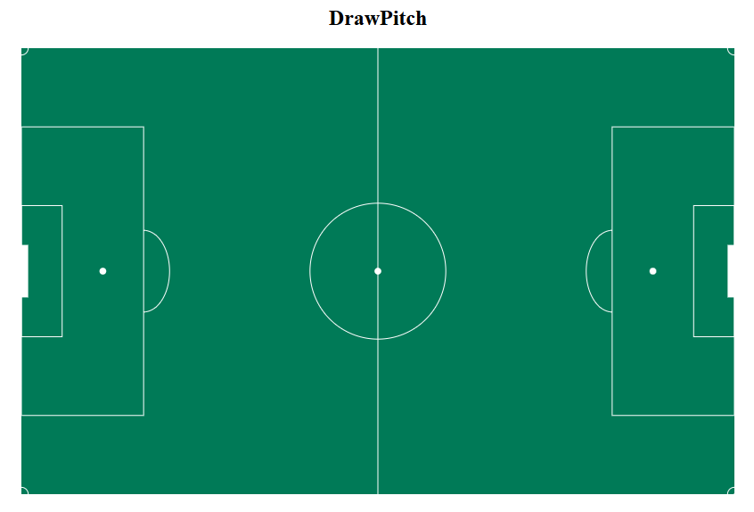
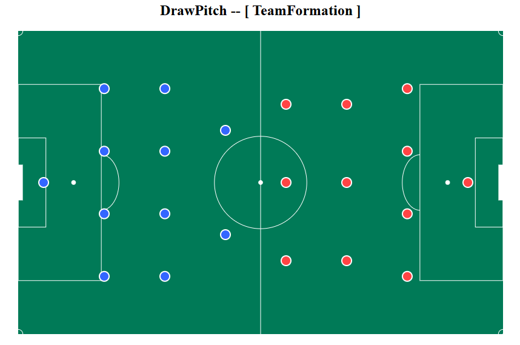
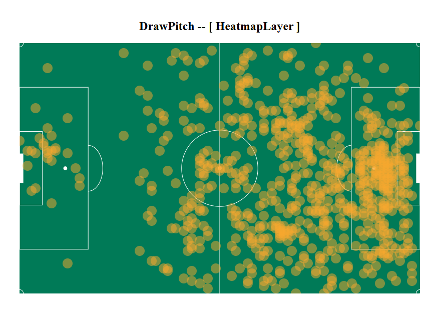
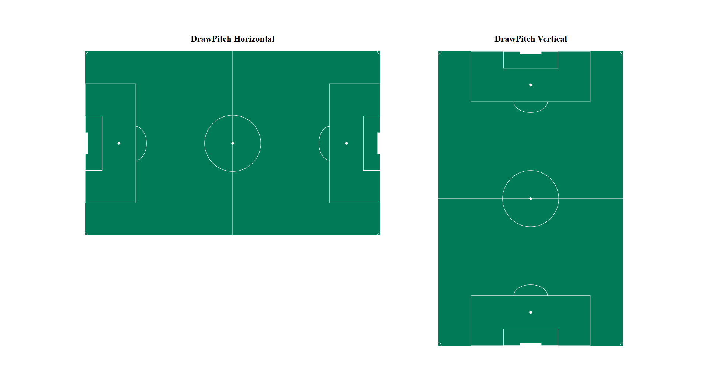
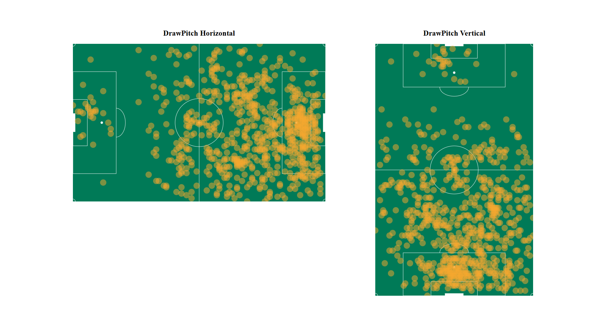

# DrawFootballPitch

## 🧠 Overview

`draw-football-pitch-library` is a React component library designed to visualize football (soccer) data. It provides scalable and customizable components to render a full or half football pitch, team formations, and heatmaps.

Whether you're building a match dashboard, tactical analysis tool, or visual story, this library helps you bring football data to life using SVG and context-aware rendering.

---

## ✨ Features

- **Realistic, scalable football pitch** (horizontal or vertical orientation)
- **Team formations overlay** using flexible layout logic
- **Heatmap visualization** with SVG circle overlays
- **Support for half-pitch and full-pitch views**
- **Context-based geometry and orientation API**

TeamFormationLayer

The `DrawPitch` component is the foundation of the library. It renders a scalable football pitch using SVG and provides pitch geometry and orientation through React Context to child components like formations or heatmaps.

### 📐 Props

| Prop            | Type          | Default        | Description                                                     |
| --------------- | ------------- | -------------- | --------------------------------------------------------------- |
| `width`         | number/string | `800`          | Total pitch width in pixels                                     |
| `height`        | number/string | `500`          | Total pitch height in pixels                                    |
| `orientation`   | string        | `"horizontal"` | Pitch direction: `"horizontal"` or `"vertical"`                 |
| `grassColor`    | string        | `"#007A57"`    | Background color of the pitch                                   |
| `lineColor`     | string        | `"#fff"`       | Color for field lines                                           |
| `lineWidth`     | number        | `1`            | Width of all field lines                                        |
| `goalPostColor` | string        | `"#fff"`       | Color of the goal area                                          |
| `cornerR`       | number        | `1`            | Radius of corner arcs                                           |
| `children`      | ReactNode     | `null`         | Additional SVG elements or overlay components (formations etc.) |

---

### 🧠 Context API

The component exposes internal dimensions via `PitchContext`, accessible by any child:

```js
const { width, height, orientation, axisX, axisY, scalePitch } =
  useContext(PitchContext);
```

```jsx
import DrawPitch from "./components/DrawPitch/DrawPitch";

<DrawPitch
  width={800}
  height={500}
  orientation="horizontal"
  grassColor="#007A57"
  lineColor="#fff"
  lineWidth={3}
  goalPostColor="#fff"
  cornerR={3}
/>;
```

This is the default appearance of the `DrawPitch` component:



---

# TeamFormationLayer

The `TeamFormationLayer` component renders a football team’s formation directly on the pitch. It uses the context from DrawPitch to calculate player positions based on the provided formation string, pitch size, and orientation.

### 📐 Props

| Prop         | Type      | Default     | Description                                                             |
| ------------ | --------- | ----------- | ----------------------------------------------------------------------- |
| `formation`  | `string`  | `"4-3-3"`   | Formation string (excluding GK), e.g. `"4-4-2"`, `"3-5-2"`              |
| `isHomeTeam` | `boolean` | `true`      | If `true`, renders team on the left/top side of the pitch               |
| `color`      | `string`  | `"#3366FF"` | Fill color for player circles (defaults to blue/red based on home/away) |
| `radius`     | `number`  | `8`         | Radius (in px) for each player circle                                   |
| `fullPitch`  | `boolean` | `false`     | If `true`, renders players across the full pitch instead of half        |

---

```jsx
import TeamFormationLayer from "./components/layers/TeamFormation/TeamFormationLayer";

<TeamFormationLayer
  formation="4-4-2"
  isHomeTeam={true}
  color="#3333cc"
  radius={8}
  fullPitch={false}
/>;
```

This is the appearance of the `TeamFormationLayer` component:



---

# HeatmapLayer

he `HeatmapLayer` component renders heatmap data as SVG circles on top of the football pitch. It takes an array of `{ x, y }` points (as percentages of pitch dimensions) and visualizes them using customizable color, radius, and opacity.

It uses the pitch context from `DrawPitch` to ensure accurate scaling and orientation for each heat point.

Use this component to visualize:

- Player activity zones
- Ball touch locations
- Tactical intensity areas

### 📐 Props

| Prop      | Type     | Default      | Description                                                                       |
| --------- | -------- | ------------ | --------------------------------------------------------------------------------- |
| `data`    | `Array`  | **required** | Array of heat points `{ x, y, value? }` where `x` and `y` are percentages (0–100) |
| `color`   | `string` | `"#F7A82D"`  | Fill color for heatmap circles                                                    |
| `radius`  | `number` | `10`         | Radius (in px) for each heat circle                                               |
| `opacity` | `number` | `0.5`        | Opacity of the heat circles (0 to 1)                                              |

---

```jsx
import HeatmapLayer from "./components/layers/HeatMap/HeatmapLayer";

<HeatmapLayer data={heatmapData} color="#F7A82D" radius={10} opacity={0.5} />;
```

This is the appearance of the `HeatmapLayer` component:



---

## 🖼️ Examples

Here are additional visual examples using the `DrawPitch` system:

### ✅ Basic Pitch Rendering



### 🔷 Team Formation Example


### 🔥 Heatmap Overlay Example



---

Enjoy visualizing dynamic football formations and match data with precision and style! ⚽
